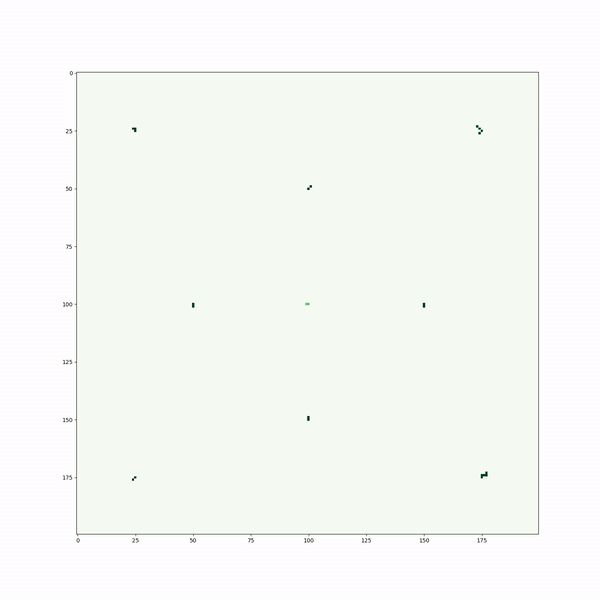

# Excluding Eden Clusters: A Cellular Automaton Simulator


This Python script simulates the growth of Eden clusters with the inclusion of a repulsion factor to emulate crown shyness patterns in tree canopies. The model is inspired by the phenomenon where tree crowns avoid touching, creating beautiful, intricate patterns in nature.


[Read more about crown shyness on Wikipedia](https://en.wikipedia.org/wiki/Crown_shyness)


## How it Works

The model is based on Eden Cluster growth, with an added repulsion factor that prevents clusters from growing too closely to one another. This introduces a behavior similar to crown shyness. The script grows clusters starting from seed points, and by adjusting parameters such as grid size, time, and repulsion factor, you can simulate different growth patterns.


### Features
- Adjustable Repulsion: Control how strongly growing clusters repel each other with the `--r` flag.
- Customizable Grid: Set the grid size for the simulation.
- Seed File for Initial Cluster Points: Customize the starting points by providing a CSV file with seed indices.
- Random Seed Generation: Automatically generate random seed points for the simulation.

### Requirements

- Python 3.x
- Numpy
- Matplotlib

### Usage:

type in your favorite CLI;

```bash
python3 run.py --r 2 --g 200 --t 100 --f seeds.csv`
```

`--r` flag : repulsion factor
`--g` flag : Grid size 
`--t` flag : final time till the simulation runs 
`--f` flag : filename containing seed indices

After it runs, it should immediatly show you the result in a seperate window! Here's a nice animation prepared with the code.


<p align="center">
  
</p>


Note: The CSV file should contain two columns, with the first column representing the x-coordinate and the second column representing the y-coordinate of each seed point.


## Generating random seeds

```bash
python3 random_seed_gen.py --g 200 --r 2 --s 6969 --N 5
```


Command Line Arguments:
- `--g`: Grid size (the size of the simulation grid).
- `--r`: Repulsion factor (for future use).
- `--s`: Random seed value (any integer to seed the random generator).
- `--N`: Number of trees (how many seed points to generate).


### ⚠️ Warning

- Currently, the simulation relies on the seeds.csv file for the initial seed values. Ensure that the grid size corresponds to the coordinates in your seed file, and adjust accordingly. For instance, if your grid size is 200x200, make sure your seed points fall within this range.

- Make sure that the repulsion factor and the grid size is not too high! It could cause the kernel to crash due to excessive RAM usage.

### Aknowledgements:
Sandra Elsa Sanjai, University of Padua, Italy


### Image credits:
<a href="https://commons.wikimedia.org/wiki/File:Crown_shyness.jpg">Akasmita</a>, <a href="https://creativecommons.org/licenses/by-sa/4.0">CC BY-SA 4.0</a>, via Wikimedia Commons


